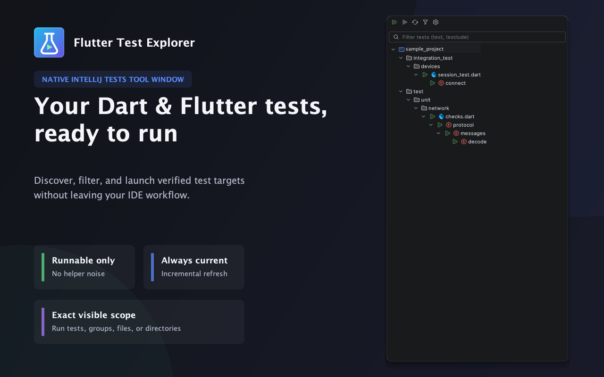
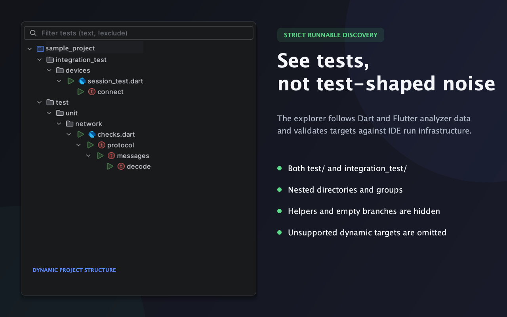
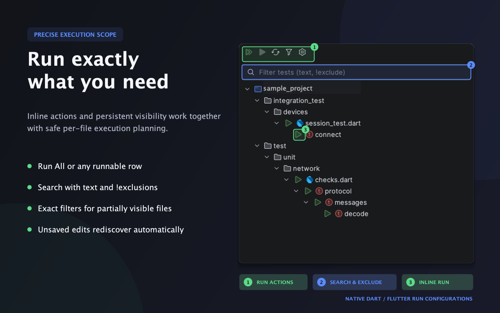

# Flutter Test Explorer

Native IntelliJ **Tests** tool window for runnable Dart/Flutter tests.



| Runnable discovery | Run and filter |
| --- | --- |
|  |  |

## Using the panel

Open **View → Tool Windows → Tests** in a configured Dart/Flutter project. `Tests` is a standard declarative IntelliJ Tool Window: use its native menu to move it, pin/unpin it or remove it from the sidebar. Restore it through **More Tool Windows → Tests**. In the New UI, windows already on the sidebar are normally omitted from More Tool Windows. The window remains available during indexing; discovery waits for smart mode. Its adaptive JetBrains-style test icon is separate from the unchanged Run action icons.

The toolbar provides:

- **Run All in Visible Scope**: runs the files included by the persistent visibility scope.
- **Run Selected**: selects an official test, widget test, group, nested group, file, or directory target. Also available from the context menu and **Shift+F10** while the tree is focused.
- **Refresh Tests**: rediscovers tests. Analysis and indexing may need to finish first.
- **Test Visibility** (funnel): persistent hierarchical checkboxes. Checking a parent includes all descendants; unchecking it excludes the subtree. Partial selection uses IntelliJ's native tri-state checkbox renderer.
- **Global Run Arguments** (gear): project-specific additional arguments, applied to every run started by this panel.

Runnable files, groups and tests also have a permanent **Run button directly before the row name**. Click that button to run its target; clicking the name only selects the row. Double-click the name to navigate to source. The inline button, toolbar, context menu and Shift+F10 all use the same execution service and safety checks. Directories keep their toolbar/context-menu run action.

The search field temporarily narrows the visible tree by path/group/name; words are ANDed and `!word` or `-word` excludes a term. Search does not change saved visibility **or execution scope**: Run All runs the configured checkbox scope, and Run Selected uses the selected node's configured scope, not the temporary search results.

Editing a test (including unsaved editor changes) automatically rediscovers that file after a 350 ms debounce. Run remains available while discovery/indexing is pending: it waits for current discovery of its scope, resolves the selected ID in the new model and only then prepares the native configuration. An edit that races with preparation or changes a queued file triggers another targeted update, not a project Refresh or a repeat of completed files. Unchanged IDs, visibility and tree branches are preserved. Refresh remains the explicit force-full-refresh action. See [edit → Run verification](docs/edit-and-run.md).

Example global arguments (separate options with spaces or newlines):

```text
--dart-define=ENV=test
--dart-define=COUNTRY=ru
--timeout=30s
```

These are additional **test-runner** options, not a shell command. Flutter receives `TestFields.additionalArgs`; Dart receives `DartTestRunnerParameters.testRunnerOptions`. Use arguments appropriate to the selected runner. Flutter 95 splits its additional arguments on literal spaces without handling quotes: separators are normalized, but values containing whitespace are rejected before launching. For Dart defines with such values, use `--dart-define-from-file` with a path without spaces. Dart's native parser supports double-quoted values. Name/path target selectors are managed by the explorer because user-supplied selectors could broaden the scope. Existing user configurations and templates are not changed.

## Predictable execution with exclusions

Execution resolves the complete model against persistent visibility checkboxes, independently of Swing rows and temporary text search:

- **FULL:** the ordinary native test/group/file target, without an extra filter.
- **PARTIAL:** one native file execution with an exact regexp union of the included tests' full names (enclosing groups + test name). Hidden test bodies do not run; Dart source is never changed.
- **EMPTY:** no launch; “No visible tests to run”.

Run All and Run Directory retain the sequential queue of explicit included **files**. Fully included files use native file targets; partially included files get one filter each; excluded files are omitted. The queue stops on failure/cancellation. One process per file prevents a name in a hidden file from being selected by a cross-file regexp. The complete batch and global arguments are validated before any launch.

Native short-name targets use substring matching. If a FULL selected group/test could match a known hidden sibling in the same file, it gets an exact filter as a safety exception. Unknown full runtime names or identical full names split across the selection boundary cannot be safely distinguished and are rejected with an explanation. See [filtered execution and native verification](docs/filtered-execution.md).

## Discovery and persistence

Discovery dynamically finds package `test/` and `integration_test/` directories under the opened project, including nested packages and arbitrary subdirectories. Both roots appear when they contain runnable tests; missing or empty roots/branches are omitted. Candidate files include standard `*_test.dart` files **and other Dart files with an indexed `main` entrypoint**. The filename is not proof of runnability. Flutter candidates come from the **same analyzer UNIT_TEST_TEST / UNIT_TEST_GROUP entities used by Flutter gutter markers**, including custom annotated APIs recognized by the analyzer, and pass the official `FlutterUtils.isInTestDir` context check. Unopened files receive outline subscriptions too. There is no method-name fallback for Flutter wrappers or project-specific path/name list.

Runnable candidates must have a literal non-interpolated name, valid PSI, registration context under top-level `main`/recognized groups, and a valid official test configuration. A recognized group with a dynamic name may remain as a **non-runnable structural parent** of runnable literal-name tests; its label shows the source expression. Helper implementations, setup bodies, arbitrary similarly named methods, comments, incomplete files, unsupported dynamic leaves and empty branches are omitted. Dart-only projects additionally resolve `test`/`group` declarations to the test packages and require an exact official producer target. Discovery never executes Dart code.

The model has explicit `id`, `runnable`, source location and run target. Files/directories are structural aggregations over runnable descendants. Discovery runs in a cancellable, committed-document, smart-mode non-blocking read action. The existing tree stays visible while indexing/discovery is pending.

Initial candidates use `FilenameIndex` for package roots, `FileTypeIndex` scoped to test directories and `DartComponentIndex` for entrypoints. Per-file results (including empty results) are cached by authoritative document/VFS stamp and Flutter outline revision. Debounced edits rediscover only affected candidates. Flutter's analyzer handles semantic dependency changes; Dart-only dependencies use existing import/export/part indexes, not helper PSI. New/deleted/moved files update the affected branches, preserving unaffected Swing nodes, expansion, selection and scroll where possible. Visibility/search run in the background on the cached model; they do not trigger discovery.

Full candidate reconciliation is reserved for startup, explicit Refresh, SDK/root/package configuration changes, analyzer reconnection and structural changes that may introduce/remove package roots. A content edit or outline update does not search the project again. Explicit Refresh also bypasses cached results.

Settings are stored per project in IntelliJ's workspace storage. IDs encode project-relative paths, node kind, enclosing group identities, name and duplicate occurrence; offsets are not persisted. Ordinary line insertions preserve selection. A rename/move is a new identity and is included by default. Stale exclusions are harmless and retained for files that return after branch changes. Identically named siblings are distinguished by occurrence; reordering indistinguishable duplicates may change their identity.

## Build and verification

Targets: **IntelliJ IDEA 2025.3.5**, **Dart 508.1.0**, **Flutter 95.0.0**.

```bash
./gradlew test buildPlugin verifyPluginStructure verifyPluginProjectConfiguration
./gradlew runIde
# Optional debug-only discovery/cache/filter/UI counters in sandbox idea.log:
./gradlew runIde -PtestExplorerDebug
```

The installable ZIP is under `build/distributions/`. Install via **Settings → Plugins → gear → Install Plugin from Disk** and restart the IDE.

Tests cover the PSI filtering pipeline, analyzer entity mapping, non-runnable/empty pruning, IDs, hierarchical visibility/tri-state, stale IDs, temporary filtering, XML settings persistence, quoting, official configuration generation and non-mutation of user configurations/templates. They also cover inline hit-testing, row selection vs execution, renderer accessibility, incremental Swing identity/state, cache hits/misses, empty results, dependency invalidation, VFS rename/move events, indexed candidate lookup and a warm-PSI performance comparison. Tests do **not** launch the application's integration tests. The unrelated bundled Vue plugin is disabled only in the test sandbox due to its IDEA 253 test-classloader resource lookup failure.

## Compatibility and current limitations

See [API research and compatibility notes](docs/intellij-test-infrastructure.md) for the inspected classes, public vs implementation APIs, classloader workaround, and fallback rationale.
See [inline Run and performance report](docs/inline-run-and-performance.md) for implementation choices, measurements and remaining full-refresh conditions.
See [native Tool Window sandbox verification](docs/native-tool-window-verification.md) for More Tool Windows, icon, dynamic roots and renderer checks.

- Flutter/Dart must be installed and SDK/package resolution configured. Missing/stale analyzer data fails closed; it does not trigger heuristic discovery.
- Full parity is intentionally narrower for dynamic/nonliteral names, helper registration and malformed PSI. Only verified literal targets in entrypoint registration contexts are shown.
- Run All results appear in normal IntelliJ Run windows; the tree does not yet aggregate passed/failed status, coverage or history like VS Code Testing.
- Partial groups/files use exact filters; unknown runtime names and indistinguishable duplicate full names still fail closed. Directory/Run All use one native session per included file.
- Plugin upgrades require rechecking the implementation API adapters against the installed versions.
